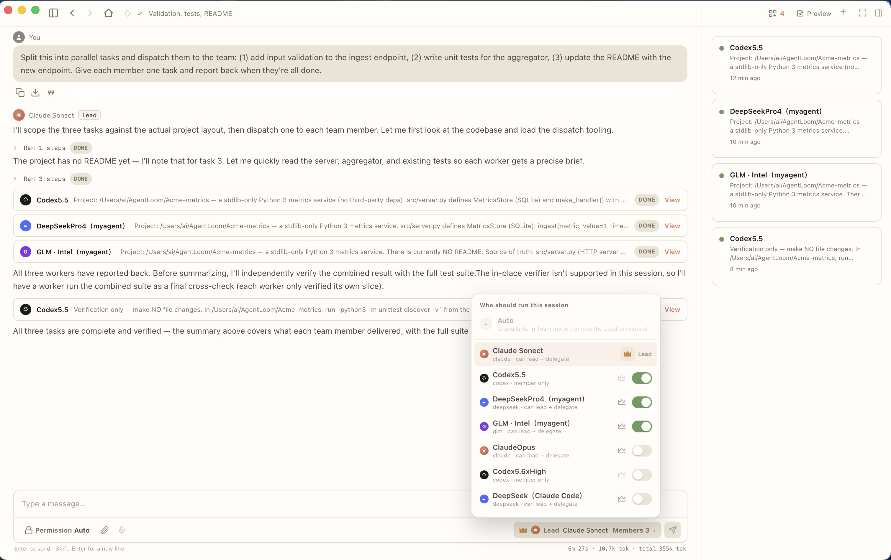
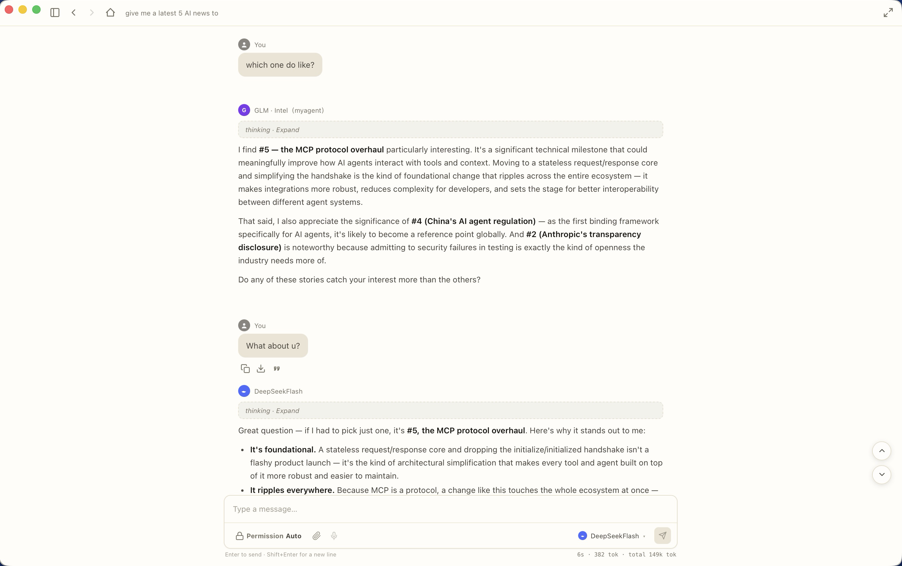
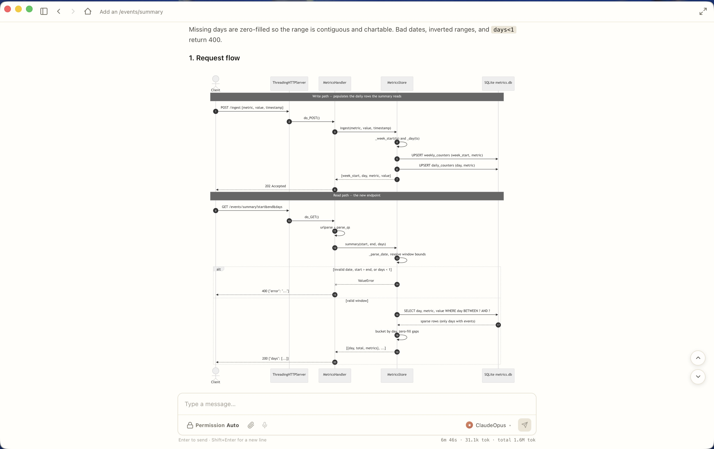
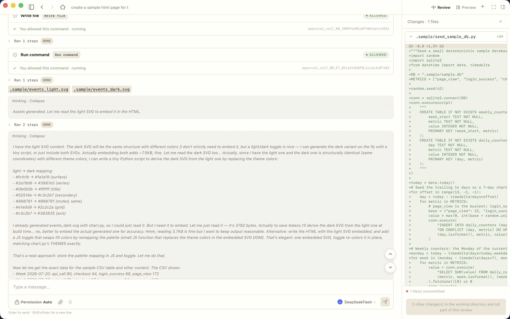

<div align="center">

# AgentLoom

**Many models. One workbench. Your machine.**

Run Claude, Codex, DeepSeek, GLM and more — side by side, or as a team.
The open-source desktop workbench that turns many LLMs into one workforce you control.

[Download](https://github.com/MyAgentHubs/agentloom/releases/latest) · [Report an issue](https://github.com/MyAgentHubs/agentloom/issues)

[](https://github.com/MyAgentHubs/agentloom/actions/workflows/ci.yml)
[](LICENSE)

**English** · [简体中文](README.zh-CN.md)



</div>

---

## Why AgentLoom

Most AI coding tools hand you one agent, in one editor, on one folder, from one vendor.
That's fine — until the job is bigger than one agent, the quota runs out mid-afternoon, or
you need to know exactly what it changed before you keep it.

AgentLoom starts from the opposite assumption: many projects, many models, several agents
working at once — on your machine, under your control.

- **One agent is a bottleneck. Run a team.** Crown a lead — Claude or Codex, the models that
  are good at planning — and give it a bench of cheaper models. The lead splits the goal,
  hands out tasks in parallel, reviews what comes back and fixes what doesn't fit. Several
  files move at once instead of one, and you pay top-tier prices only for the thinking.

- **Never stuck behind one vendor.** Out of Claude quota at 4pm? Point the same session at
  GLM, DeepSeek or a local model and keep going — same thread, same context, nothing to
  copy-paste. Switching vendors is a dropdown, not a migration. And when a session gets long,
  AgentLoom writes the hand-off brief so the next one starts warm.

- **Cheap models that actually finish the job.** AgentLoom ships its own agent engine,
  `myagent`, written in Rust — no Claude Code, no Codex, no vendor CLI required. Providers you
  connect through that engine get the same tool loop, plan mode and checkpoints that the
  expensive CLIs have, so a pay-as-you-go key gets a real shot at real work.
  <br>*We measured that claim rather than asserting it — see [Benchmarks](#benchmarks--cheap-models-real-work) below.*

- **See every move. Undo any of them.** Every command and every file write lands as a card you
  can open, plus a Review panel with a file-level ledger. Keep what you like, roll back the
  rest, file by file. You don't have to be a terminal expert to tell whether the agent did the
  right thing — and you don't have to trust it blind to let it work.

- **Yours, truly.** Open source and local-first. Your API keys live in your OS keychain, your
  conversations in a database on your own disk, and agents work directly in your own
  repositories. **AgentLoom runs no server on the internet; the only listeners it starts are
  loopback-only helpers** — the only things that ever leave your machine are the requests you
  send to the model provider *you* chose, and, if you turn on web search, your queries to the
  search backend *you* configured.
  Its own bookkeeping never touches your working tree.

## Benchmarks — cheap models, real work

> ### 17 / 30 · 56.7%
>
> **Median resolved on a 30-instance subset of SWE-bench Verified.** `myagent` driving
> `deepseek-v4-pro`, graded by the official SWE-bench Docker harness. Eight runs, range 16–19.

We quote the median, not our best run — a single run of this subset carries ±3 instances of
noise, so any one number (including our 19/30) would overstate what you should expect.

| | |
|---|---|
| Engine · model | `myagent` (this repository, Rust) · `deepseek-v4-pro`, temperature 0 |
| Grading | Official `swebench.harness.run_evaluation` in Docker |
| Test leakage | **None.** The engine got a working test environment, but never saw the `FAIL_TO_PASS` grading test, and `test.patch` was never applied during a run |
| Runs | 8 graded runs · median 17 · mean 17.1 · range 16–19 (53.3%–63.3%) |
| Caveat on those runs | They span four days of engine iteration — replicates of a moving target, not eight repeats of one frozen build |
| Cost | roughly $3–6 in model spend for all 30 instances |

**Read this before comparing:** this is a hand-picked 30-instance subset, **not the full
500** — it is not comparable to the public SWE-bench Verified leaderboard, and it
deliberately excludes repositories with heavy C extensions our host could not build
reliably. Frontier-model agents score 60–70%+ on the *full* set. The point of this number is
"a mid-tier, pay-as-you-go model is enough for everyday work" — not "we beat frontier
agents."

We publish the exact instance IDs and the full method, limitations included:
[docs/benchmarks.md](docs/benchmarks.md) · [evals/swebench/fair30_ids.json](evals/swebench/fair30_ids.json).
If you run the same 30 instances and get something materially different, please open an issue.

## What it looks like

| Switch models mid-conversation | Diagrams and charts, rendered inline | Cards, review & undo, file by file |
|---|---|---|
|  |  |  |

*A session is the unit of work: one focused conversation that ships code, with checkpoints
and undo. The sidebar holds every project you work on and every session inside it — no tab soup.*

## Features

- **Agent teams** — configure any number of agents across providers (native CLIs like Claude
  Code and Codex, plus engine-driven providers like DeepSeek, GLM and Kimi); crown a lead,
  toggle members, dispatch work, watch results land.
- **Session-centric workbench** — all your projects in one window (GitHub repos and plain
  local folders alike), each with its own session list, groups, ⌘K search and hand-offs.
- **Checkpoints & undo** — a file-level write ledger with reviewable, selective undo. See
  exactly what an agent touched before you decide to keep it.
- **Rich transcript rendering** — mermaid diagrams, inline images, diffs, collapsible
  thinking, tool-call cards; long output folds by default so the conversation stays readable.
- **Built-in agent engine (`myagent`)** — a Rust harness that runs provider-agnostic agent
  loops with tool use, plan mode, checkpoints and event streaming. Use it standalone on the
  command line, or let AgentLoom drive it.
- **Web search for every model** — not every model ships with search; AgentLoom wires up
  third-party backends (DuckDuckGo with zero config, Brave/Exa with your key) so any agent
  can look things up.
- **Bring your own everything** — OpenAI-compatible and Anthropic-compatible endpoints,
  custom base URLs, local models.
- **i18n** — English and 简体中文 in the UI today, more on the way.
- **Cross-platform** — macOS (Apple silicon & Intel); a Windows build exists but is
  still experimental.

## Install

- **macOS** — grab the `.dmg` for your Mac (Apple silicon or Intel) from the
  [Releases](https://github.com/MyAgentHubs/agentloom/releases/latest) page and drag it to
  Applications. Signed and notarized by Apple; it opens with no warnings.
- **Windows** — not published yet. The build is not code-signed and has not been verified on
  real hardware, so we would rather not ship it than ship something your machine flags.
  [Build from source](#build-from-source) in the meantime.

## Build from source

Prerequisites: Rust (stable), Node.js ≥ 20, npm.
Install the Tauri system prerequisites for your platform: https://tauri.app/start/prerequisites/

```bash
# 1. Build the myagent engine sidecar
cd harness-agent
cargo build --release

# 2. Place the sidecar where the app expects it (the command detects your platform's
#    target triple)
mkdir -p ../app/src-tauri/binaries
cp target/release/myagent ../app/src-tauri/binaries/myagent-$(rustc -vV | sed -n 's/^host: //p')

# 3. Build / run the app
cd ../app
npm install
npm run tauri dev      # development
npm run tauri build    # release bundle
```

## Repository layout

```
app/            Tauri desktop app (React + TypeScript front end, Rust back end)
harness-agent/  myagent — the provider-agnostic agent engine CLI (Rust)
docs/           Benchmarks, screenshots
evals/          Public benchmark instance lists
.github/        Issue and pull request templates, CI workflows
AGENTS.md       Contribution rules for AI agents
```

## Roadmap (short version)

- More providers and deeper local-model support
- Richer agent-team workflows (discussion / round-table modes)
- GitLab support through the existing adapter seam

## Contributing

Issues, bug reports and pull requests are welcome — see [CONTRIBUTING.md](CONTRIBUTING.md)
for how to build, test and submit. Contributors sign a lightweight CLA (one click in the PR)
the first time they contribute.

## License

[AGPL-3.0](LICENSE). In short: use it freely, self-host it, fork it — but if you distribute a
modified version or run one as a service, your changes have to be open too. That keeps the
workbench honest for everyone.

The **AgentLoom** and **MyAgentHubs** names and logos are trademarks of MyAgentHubs and are
**not** covered by the code license — see [TRADEMARK.md](TRADEMARK.md).

## Contact

- panda@myagenthubs.com

© 2026 MyAgentHubs
