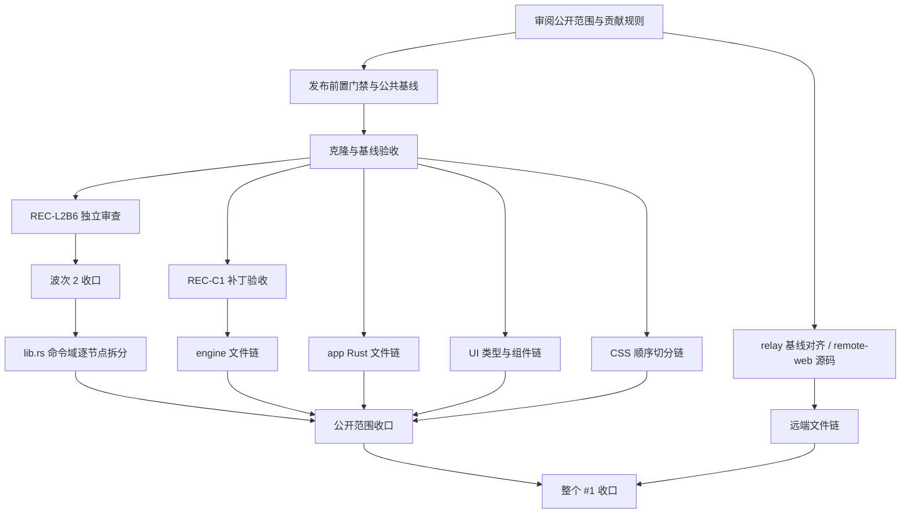

# #1 代码规范债务清偿：贡献者交接与任务图

状态：**维护者已批准 public AgentLoom 专用分支与任务图；启动须以 state/publication.json 的已验证基线为准。** 核查日期：2026-09-21（Asia/Tokyo）。本目录可以直接给 ChatGPT 或其他 LLM 使用，不需要原对话、Claude Skills、Agent 工具、私有文档或原作者的机器路径。

## 目标与完成判定

在不改变 AgentLoom 行为、事件协议、数据格式、安全边界和测试覆盖的前提下，清偿 #1 存量代码规范债务：注释治理、文档孤儿、长函数和超标文件。成功不是把检查器跑成绿色，而是实际债务降至批准的终态。

- 普通 Rust 文件 <=800 行；前端生产文件 <=500 行；CSS <=800 行；被检查器识别的测试文件 <=1500 行。新文件建议 <=90% 上限。
- 前端必须另外清偿 long-functions.json 的 ESLint 例外；强制启用同一条 150 行规则复扫，不能只看忽略名单下的 lint PASS。
- `too_many_lines` 按现有 Clippy 150 行规则检查；只保留已经批准的 `lib.rs::run` 例外。不得为达标新加 allow、宏、格式跳过、压成单行或提高基线。
- engine 自有 `file_size_ratchet` 与仓库检查器是两套规则，必须同时通过。测试目录并不一律自动按 1500 分类；读取实际 `category()`。不要将测试 helper 改名为 tests 以规避生产文件额度。
- 已治理的 dated/ledger 注释、孤儿文档不得回退。新路径的 CJK 注释额度为 0；搬迁时忠实译成英文，保留工程原因，不改用户文案。
- 本次采用两个完成节点：`CLOSE-PUBLIC` 只完成公开可执行部分；`CLOSE-ALL` 还要求远端部分的真实验证。不能混用。

不是本任务：新增功能、改协议、改变 UI、架构重写、升级依赖、部署、发版、清理其他贡献者工作目录。历史覆盖缺口仅在本次拆分触及或导致守卫退化时纳入；其余独立记账。

## 项目地图

AgentLoom 是多 LLM 协作的桌面工作台。`app/src` 是 React/TypeScript UI；`app/src-tauri` 是 Tauri/Rust 后端（会话、数据库、进程、工具和事件）；`harness-agent` 是 Rust engine，crate 名 `myagent`，承载工具循环、计划、评估与 provider。`remote-relay/fixtures` 是 app 测试需要的协议样张。

两个现有公开仓：

- 桌面端及 engine：https://github.com/MyAgentHubs/agentloom ，默认 `main`，本次观察 SHA `16db362c93724d352272972c28d1a09dab470813`。
- relay：https://github.com/MyAgentHubs/agentloom-remote-control-server ，默认 `master`，观察 SHA `cea5b8dbe807e0cb62c204238d87bbe5253297a4`。

relay 已公开，但本任务清单来源与它的版本不同：11 个相关路径中，9 个内容不同、`test/msg-reply-route.test.js` 缺失、`test/wire-fixture.test.js` 相同。先做基线对齐，不能直接套用这里的行数。该仓含 `web-dist` 构建产物，未发现 remote-web 源码；不要把打包后的 JS 当源码拆分。

已批准本次发布结构：agentloom 的 `myagenthubs/number1-debt-graph` 专用分支承载公开快照和本目录；relay 继续使用原仓，之后单独批准其分支和基线；6 个 remote-web 文件记录源码缺失并延期。这仍是一个完整任务图，有明确的跨仓依赖。本次只执行 public AgentLoom；relay/Web 的分仓或整合由维护者以后裁决，相关节点标 deferred_by_maintainer。

## 当前做到哪里

以下区分源基线历史、待审补丁与本次公开克隆的验收结果。

| 项目 | 状态 / 证据 |
|---|---|
| 已完成波次 1 | dated/ledger 注释 0/0、孤儿 0；历史验收已完成 |
| Rust 长函数 | 39 个实际 Clippy 长函数例外已清 37 个，剩 `start_lead_session` 与批准保留的 `run` |
| 前端长函数（本次补查） | app 42 个 / 35 文件；remote-web 4 个 / 4 文件；原 39 个 Rust 口径遗漏此项，详 long-functions.json |
| engine 主循环 | 长函数已归零，`run_loop.rs` 757 行；旧稿“800 行、勿动”已过期 |
| 波次 3 | 当前实扫 60 个超标文件、83,501 行超上限债务；不是 60 个门禁失败 |
| 公开范围 | 43 个文件；relay 来源 11 个；remote-web 6 个；详 inventory.json |
| 已合入源基线 | `463b2bd9` 的 9 项 CI 于本次核查全部 completed/success |
| 本次导出源 | `d1fe4ad3`，比上述基线多一个文档提交，源码状态相同 |
| L2B6 | `47d38bd3` 已提交且工作区干净；已有测试报告为 app 2946 通过、ratchet 10 通过，尚待独立 L2 审查。本轮未重跑这些编译测试 |
| W3-C1 | `c4e0e36f` 已提交并完成原协调者 L0 检查；3 个 engine 文件待合；补丁合入后重新验收 |
| W3-C2 / W3-B2 | 只建立了工作区，没有实现；公共贡献者应建立自己的克隆，不能依赖旧工作区 |
| 新 public 快照 | 公开克隆已完成 engine 全量测试、app 2946 项 lib 与全部 integration 测试、前端 2613 项测试及 build；初始失败与复验记录见 evidence/verification.json |

L2B6 合入后长函数例外应为 1（`run`）；C1 合入后全范围超标文件应从 60 到 57、公开范围从 43 到 40。以重扫为准，不能把 pending 补丁提前算为 done。仅 Rust 长函数按数量已完成约 94.9%；这不是整个 #1 的总体完成率，剩余文件拆分规模差异很大。

## 阅读入口与最小持久状态

1. 先读 START.md、本文件与 `state/publication.json`，确认公开基线已批准。
2. `graph.json` 是 110 个父节点的依赖与合同：60 个文件大小节点、39 个前端长函数文件节点及恢复、发布、跨仓、收口节点。`TASKS.md` 是人类索引，`inventory.json` 保存逐文件 SHA-256/行数/上限。
3. `FIRST-TASKS.md` 给第一批精确子单；`EXECUTION.md` 规定 loop、验收和跨模块风险；`tools/` 提供不依赖第三方 Python 包的验证入口。
4. `state/index.json` 只保存节点状态、claim、基线、结果和证据路径。每个正在执行的节点另存 `state/<id>.json`，日志放节点证据目录；不要把整段聊天当状态。
5. `patches/` 带两份可移植源码补丁及 SHA-256；不需要访问源分支或私有历史。只包含各自源码/测试差异，不包含旧文档回退。

## Graph → loop → harness 的执行合同

```yaml
goal: 将 app/src-tauri/src/commit_broker.rs 的内联测试外移，使宿主 <=800 行，行为不变
scope:
  read: [app/src-tauri/src/commit_broker.rs, app/src-tauri/Cargo.toml]
  write: [app/src-tauri/src/commit_broker.rs, app/src-tauri/src/commit_broker/tests.rs]
state: docs/number1/state/B2-commit-broker.json
worker: {model: gpt-5.6-terra, reasoning_effort: medium}
verify:
  - bash docs/number1/tools/verify.sh app
  - python3 docs/number1/tools/check_graph.py --target app/src-tauri/src/commit_broker.rs
budget: {max_rounds: 3, max_minutes: 60, max_tokens: 24000}
stop:
  success: 用例和断言不减、所有检查通过、独立复核通过并合入节点分支
  no_progress: 同一失败连续两轮没有新证据，或任何预算耗尽
escalate: [范围扩大, 新路径不能满足上限, 守卫失效, 缺 macOS 构建环境]
```

模型是历史用户选定的成本分级，不保证每位贡献者都能调用这些名字。机械搬迁默认 Terra medium；代码逻辑/测试 Sol medium；只有复杂且有证据的升级请求才考虑 Astra high。不可用时记录实际模型和档位，不能默默升级；不需要安装 Claude。使用自己的正常 sandbox/权限，不照抄历史绕过参数。

每个 `file_epic` / `function_epic` 必须先展开成可独立审查的小节点（通常宿主 + 1 个新文件 + 必要测试），给出精确 allowlist、实际符号、依赖与成功条件，再开始实现。每个子节点独立受预算限制；父节点不是一次运行 130 单的许可。每批默认最多 2 个不同组件 worker、总 token 上限 80,000；达到上限提交状态给维护者。无法读取真实 token 使用时按更短轮数/时间停止，不伪造统计。



## 已批准的发布边界与记录

1. **分支与内容**：已批准上述专用分支；只从 public main 建公共历史，再导入经过审查的源码快照与本交接。不得直接将私有 `work` 推到 public，亦不得把内部完整 HANDOFF/聊天/绝对路径上传。
2. **公开包转换**：原导出会扫描被导出的残留检查器，产生自匹配失败。本候选包明确排除两个仅服务于内部导出的诊断文件，详 `package-transforms.json`；未修改源仓，未忽略扫描错误。完整候选包重扫为 0 命中。发布时必须复现该转换和扫描，不上传原始失败导出。
3. **公共 main 保真**：公共 main 最新 raw-path/Linux 测试修复保留；已对照公共树差异，保留公共独有文件。快照更新不等同于全部历史改动重新独立代码审查。
4. **分支 CI**：本任务分支已接入公共 CI：PR 使用事件 base SHA，后续 push 使用 before SHA，首次任务分支 push 固定到已批准 public main SHA。不能在候选代码运行前将其 HEAD 自动设作通过用的基线。公共 CI 不应引用维护者私有 self-hosted runner/secret。首次分支基线由维护者批准。
5. **贡献许可**：现有 CONTRIBUTING 对重构要求 accepted issue、限制每人一个 PR，并要求人类负责说明。本分支 AGENTS.md 与 CONTRIBUTING.md 已明确 public 节点属于 accepted campaign，领取一个 ready 节点后可提交到本任务分支，无需重复开提案 Issue；范围外工作仍需批准。LLM 可以准备草稿，人类需核实并自行负责公开说明。
6. **完整验收**：本次公开克隆已重新构建并跑过组件测试、类型检查、lint 和门禁；这不包含签名、发行打包或部署。初始缓存环境与计时测试失败、修正后的定向及全量复验均记入证据。Gitleaks 本轮有 26 个告警，均定位于与现有 public main 字节相同的固定协议/密码学测试样张；这不等于扫描退出码为 0。详 evidence/verification.json，不能把这些模式全局加入忽略表。
7. **范围建议**：relay 用原公开仓先对齐，remote-web 源码仍受限。`.test.js` 归类属于独立政策节点；未经批准保持 500，不把“改分类”当代码拆分成果。

维护者已批准具体 public 范围、任务图、快照与前置修正，不代表自动同意未来部署、发版或无限模型预算。

## 给新 ChatGPT 的启动消息

> 阅读当前仓库 AGENTS.md、CONTRIBUTING.md 和 docs/number1/README.md。只在 state/publication.json 已批准并填写真实 campaign_base_sha 后开始。读取 graph.json 与 state/index.json，选择依赖已完成且由维护者分配的一个节点；先检查是否已合入 REC-C1 / REC-L2B6，避免重复实现。按节点的 goal/scope/state/worker/verify/budget/stop/escalate 执行。每轮只加载当前节点及直接证据，保护其他人的工作，不假设拥有原对话或 Claude 工具。结束时回填精确 SHA、验收退出码和未解决事项。
